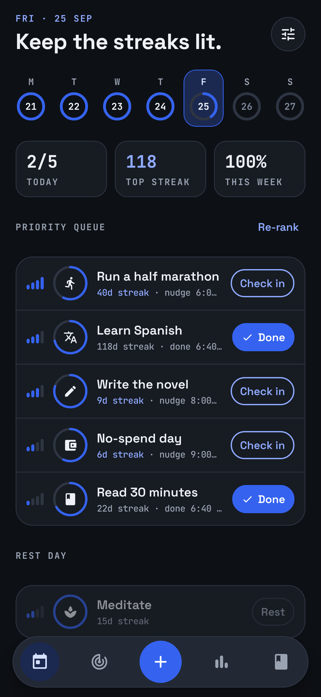
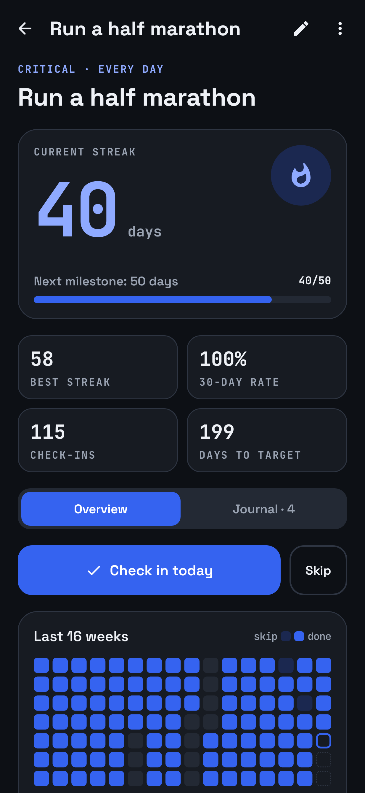
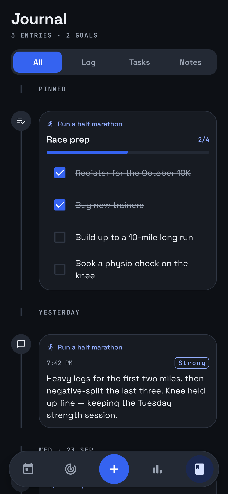
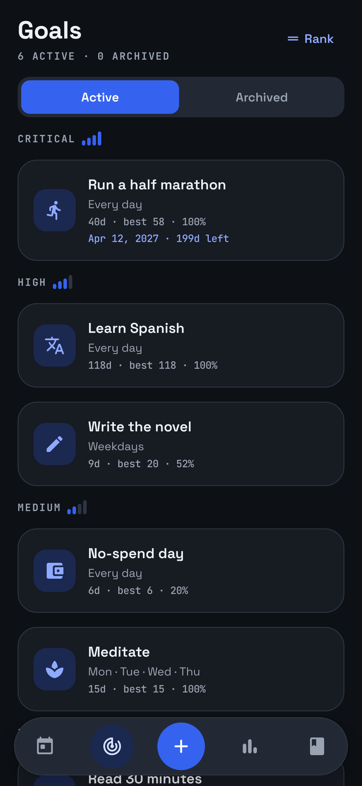
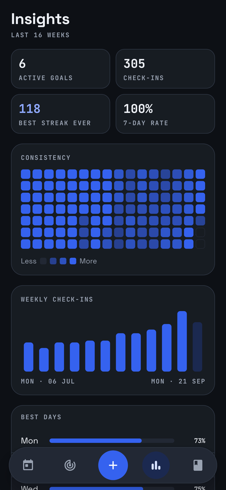
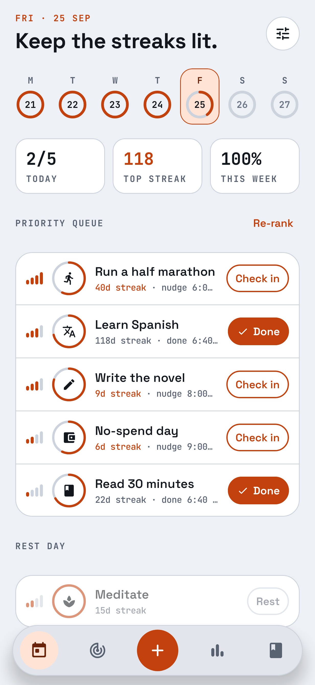

# Goal Keeper

A personal Android app for long-term goals: build **streaks**, **rank goals by importance**, get **escalating
reminder nudges** for the goals that matter most, and keep a **journal** (log entries, notes, task lists) for each goal.

Design: **Midnight Console**, a dark-first dashboard look with Space Grotesk and JetBrains Mono, progress rings,
importance "signal bars" and a 16-week streak heatmap. There are **8 colorways** (Bold Blue by default, plus Midnight
Navy, Glacier Teal, Ember Orange, Crimson, Emerald, Royal Violet and Graphite), each in dark and light mode.

## Features

- **Today**: the week at a glance (daily completion rings), today's score, your top streak and weekly rate.
  A *priority queue* lists today's goals in ranked order, with one-tap check-in, skip and undo.
- **Streaks**: consecutive check-ins on scheduled days. Days a goal isn't scheduled are rest days and never break a
  streak. Skipping a day (sick, travelling) keeps the streak without adding to it. Forgot to check in yesterday? Tap the
  day in the goal's calendar to fix it. Milestones (7, 14, 30, 50, 100… days) are celebrated.
- **Importance ranking**: Low, Medium, High or Critical. Goals are ordered by importance, then by your own manual order
  (drag to reorder on the Rank screen; dropping a goal into another tier changes its importance).
- **Reminder nudges**: each goal has a daily reminder window: first nudge time, number of nudges and the interval
  between them. More important goals get more nudges by default (Low 1 → Critical 4, up to 8). Nudges only fire on
  scheduled days you haven't checked in yet, stop as soon as you do, get firmer as the day goes on (the last one is a
  "last call"), show your streak and your *why*, and have a **Done** button right in the notification.
  An optional morning briefing summarizes the day.
- **Journal per goal**: quick log entries (with an optional mood), notes, and task lists with checkboxes, shown as a
  timeline with filters and pinning. A global Journal tab shows everything across goals.
- **Insights**: consistency heatmap across all goals, weekly check-ins, best weekdays, streak leaderboard.
- **Home-screen widget**: "Today's goals" shows your priority queue and streaks, with one-tap check-in right from
  the home screen.
- **Your data stays yours**: everything is stored on the device (Room database). Android's own backup covers the app,
  and Settings can export/import a JSON backup file.

## Screenshots

Rendered from the real Compose screens by the screenshot tests (`./gradlew :app:recordRoborazziDebug`; CI refreshes
them on every push).

| Today | Goal detail | Journal |
| --- | --- | --- |
|  |  |  |

| Goals | Insights | Light mode, Ember Orange |
| --- | --- | --- |
|  |  |  |

More screens: [goal detail, full length](docs/screenshots/detail_full.png),
[a goal's journal](docs/screenshots/goal_journal_full.png), [goal editor](docs/screenshots/editor.png),
[Rank](docs/screenshots/rank.png) and [Settings](docs/screenshots/settings_full.png).
All colorways: [colorways.png](docs/screenshots/colorways.png).

## Install

### Option A: download the APK from GitHub Actions
1. Open the repository's **Actions** tab, choose the latest successful **Android CI** run, and download the
   `goal-keeper-apks` artifact.
2. Unzip it and copy `app-release.apk` to your phone (the release build is smaller and faster; `app-debug.apk` works too).
3. Open it on the phone and allow "Install unknown apps" for your file manager or browser when asked.

Every build is signed with the same key (`keystore/debug.keystore`), so newer APKs install over older ones and keep
your data.

### Option B: build it yourself
Requirements: Android Studio (recent stable) or JDK 17+ and the Android SDK (platform 36).

```bash
./gradlew :app:assembleRelease     # app/build/outputs/apk/release/app-release.apk
./gradlew :app:installDebug        # build and install on a connected device
```

### Permissions
- **Notifications**: requested on first launch; needed for nudges.
- **Alarms & reminders** (exact alarms): optional but recommended; lets nudges fire at the exact minute. Without it
  Android may delay them a little. The app shows a hint and a shortcut to enable it.

## Project structure

```
core/   Pure Kotlin (no Android): domain models, streak rules, reminder planning, notification copy,
        insights and the JSON backup format. Fully unit tested.
app/    Android app: Jetpack Compose UI, Room database, DataStore settings, AlarmManager scheduling,
        notifications, backup import/export.
```

- `core/.../streak/StreakCalculator.kt`: the single source of truth for streak rules.
- `core/.../reminder/ReminderPlanner.kt`: when the next nudge fires; `NudgeMessages.kt`: what it says.
- `app/.../notifications/`: alarm scheduling, receivers (nudge, "Done" action, reboot/time-change re-arming).
- `app/.../data/`: Room entities/DAOs, repositories, settings, backup.
- `app/.../ui/`: theme (colorways, typography), shared components, and one package per screen.
- `app/.../widget/`: the Glance home-screen widget.

Tech: Kotlin 2.2, Jetpack Compose (Material 3), Navigation (type-safe routes), Room, DataStore,
kotlinx.serialization, AlarmManager; min SDK 26, target SDK 36.

## Development

```bash
./gradlew :core:test :app:testDebugUnitTest   # unit tests
./gradlew :app:assembleDebug :app:assembleRelease
```

CI (`.github/workflows/android.yml`) runs the tests and builds both APKs on every push.

The signing key in `keystore/` is only meant for this personal app. Don't use it for anything published.

## Licenses

Fonts: [Space Grotesk](licenses/SpaceGrotesk-OFL.txt) and [JetBrains Mono](licenses/JetBrainsMono-OFL.txt), both under
the SIL Open Font License 1.1.
